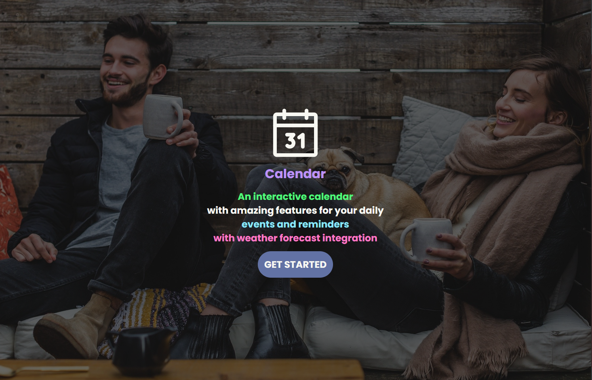
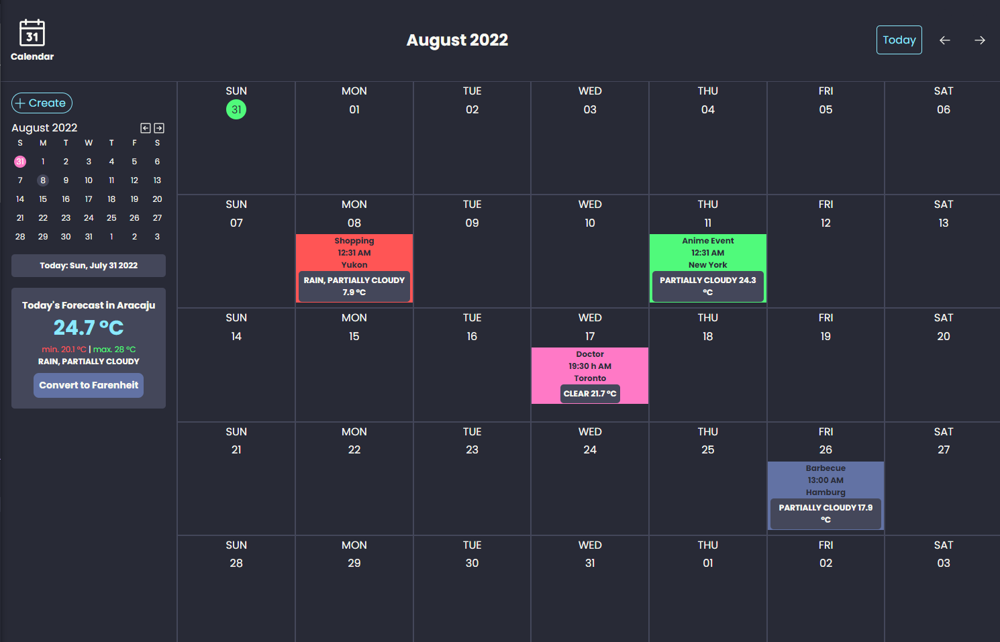
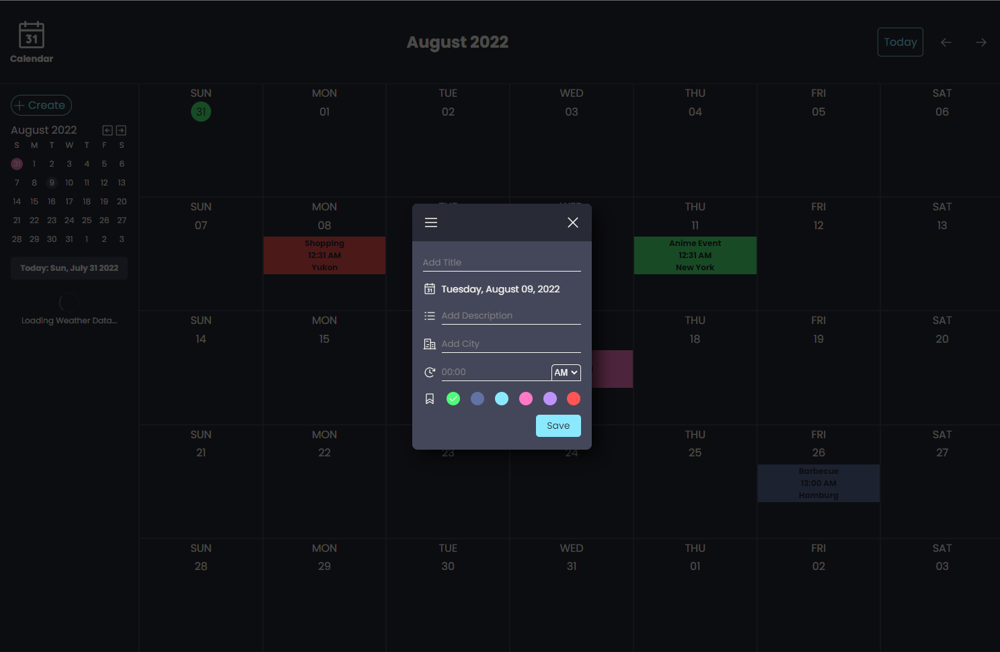
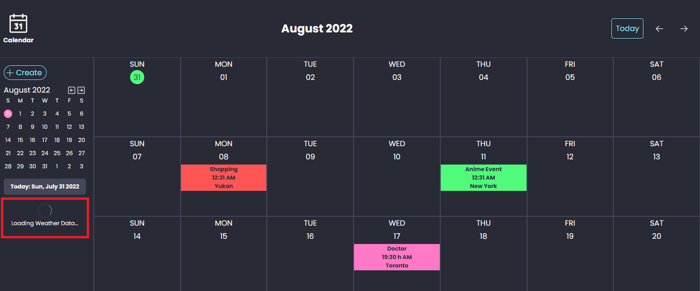
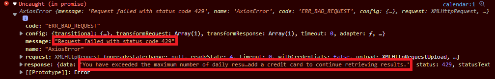
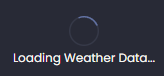
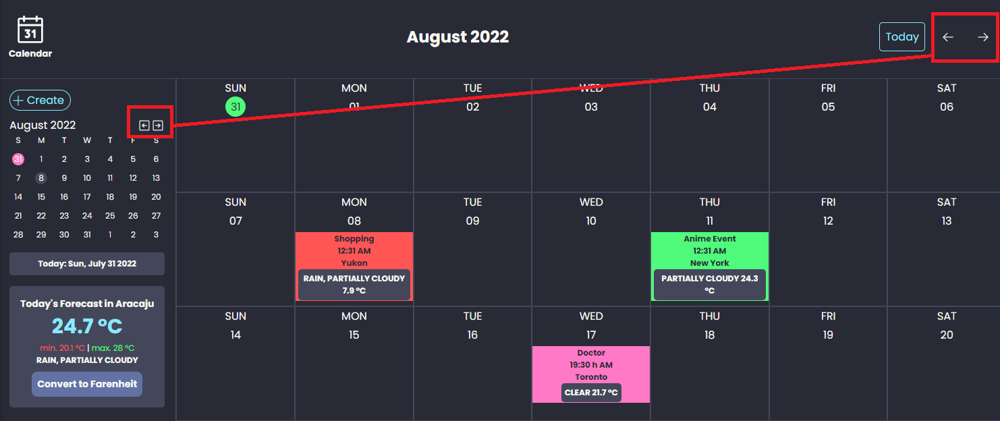
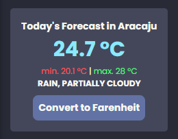

<h1>jobsity-calendar</h1>

This repository is meant to store a calendar app made using ReactJS, Typescript, Styled Components and related techlonogies.





<h2>(IMPORTANT!) Observation About Visual Crossing API</h2>

- Unfortunetly, Visual Crossing API only provides a small package of requests for free tier accounts, thus, it is possible that (maybe) the user won't be able to see the weather data neither on the Big Colendar nor see the WeatherSearcher component. The screen would be like this:

Obs.: Notice that there is a Spinner component for data Loading representation, it will be in infinite loading if there is no data to render (the API returns status code 429 - too many requests - when the total of daily requests for free tier accounts is exceeded). If you try to acceess the console, you will be able to see some information about the error that just occured.



<h2>Solutions and Technogies adpoted to create the project</h2>

- The project was developed using ReactJS;
- For proper data typing and better development experience, TypeScript was used;
- For a better CSS in JS handling and general styling, Styled Components was used;
- The library Axios was used for API consumption;
- For accessing weather data, the Visual Crossing API was used. Available at: https://www.visualcrossing.com/weather/weather-data-services#/login;
- For accessing the user's current city, the Ip Info API was used. Available at: https://ipinfo.io/developers;
- The page routing was made using React Router DOM on its most current version (6);

<h2>How to install the project's dependencies</h2>

```
yarn
```

<h2>How to Execute the Project</h2>

```
yarn start
```

<h3>Implemented Features</h3>

<h4>1. Mandatory Features</h4>

- Ability to add "reminders" (max. 30 characters) for a day and time specified by the user. Also, include a city;
- Ability to edit reminders - including changing text, city, day and time;
- Add a weather service call from MetaWeather, AccuWeather or VisualCrossing and get the weather forecast (e.g. Rain) for the date of the calendar reminder based on the city;

<h4>2. Bonus Features</h4>

- Expand the calendar to support more than the current month or year;

- Properly handle overflow when multiple reminders appear on the same date;

<h2>Project's Features and General Explanations</h2>

- The project is meant to support multiple months and years, the user can navigate through different dates, months or years by using the arrows above the Big Calendar or the ones above the small calendar:

Obs.: Notice that the Big Calendar's arrows change the state of both calendars at the same time and the Small Calendar's arrows only change the state of its own component, this is intentional, in case the user wants to visualize multiple months and different dates at the same time, however, if the user clicks on a number that represents a date on the Small Calendar it will change both calendars' states Globally.

- The WeatherSearcher component rendered on the Sibebar makes an API call from Visual Crossing API together with an API call from Ip Info API. First, Ip Info API is called to get the city the user is currently in (this city name is saved in a state), then Visual Crossing API is called using the city name saved in the state to concatenate that city name in the URL, making an Axios API call and then the component renders the weather data in that city. As a result, we have a component that looks like this:

Obs.: This Component also has a button to change the unit from Celsius to Farenheit and from Farenheit to Celsius.

